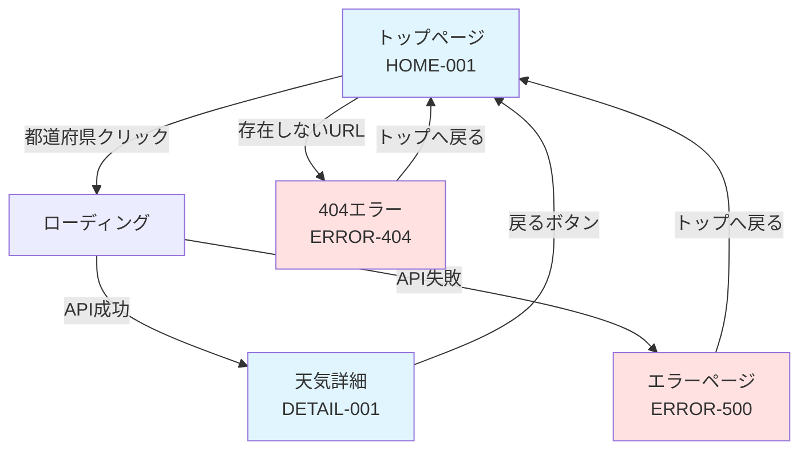

# Day 9: 画面遷移図の作成

## 📅 実施日
- 予定: Week 2 - Day 9
- 実施日: YYYY/MM/DD
- 予定時間: 8h (午前4h + 午後4h)
- 実績時間: ____h

## 🎯 目標
画面間の遷移を図で表現し、ユーザーの操作フローを明確にする

---

## 📋 午前の作業（9:00-13:00）

### 1. 画面遷移の整理（9:00-10:00）

**画面遷移の洗い出し:**

`screen-transition-list.md`を作成：

```markdown
# 画面遷移一覧

## 1. トップページ → 詳細ページ

### トリガー
都道府県カードをクリック

### 遷移元
HOME-001（トップページ）

### 遷移先
DETAIL-001（天気詳細ページ）

### パラメータ
- prefectureId: 都道府県ID（1-47）

### URL例
```
/ → /weather/13  （東京都）
/ → /weather/27  （大阪府）
```

---

## 2. 詳細ページ → トップページ

### トリガー
「戻る」ボタンをクリック

### 遷移元
DETAIL-001（天気詳細ページ）

### 遷移先
HOME-001（トップページ）

### パラメータ
なし

---

## 3. エラーページ → トップページ

### トリガー
- 404エラー発生時
- 500エラー発生時
- 「トップへ戻る」ボタンクリック

### 遷移元
ERROR-404 / ERROR-500

### 遷移先
HOME-001（トップページ）

---

## 4. ローディング状態

### トリガー
API呼び出し開始

### 状態
DETAIL-001内でローディング表示

### 終了
APIレスポンス受信後、天気情報表示
```

---

### 2. 画面遷移図の作成（10:00-12:00）

**draw.io で作成:**

```
┌──────────────┐
│ トップページ  │  START
│  (HOME-001)  │
└──────┬───────┘
       │ ①都道府県カードクリック
       │ /weather/{id}
       ↓
┌──────────────┐
│ ローディング  │
│  (表示中)    │
└──────┬───────┘
       │ ②API取得完了
       ↓
┌──────────────┐
│  天気詳細    │
│(DETAIL-001) │
└──────┬───────┘
       │ ③戻るボタン
       │ /
       ↓
┌──────────────┐
│ トップページ  │
│  (HOME-001)  │
└──────────────┘


エラー時:
┌──────────────┐
│  任意の画面   │
└──────┬───────┘
       │ エラー発生
       ↓
┌──────────────┐
│ エラーページ  │
│(ERROR-XXX)   │
└──────┬───────┘
       │ トップへ戻る
       ↓
┌──────────────┐
│ トップページ  │
└──────────────┘
```

**詳細な画面遷移図:**



**ファイル:**
- `screen-transition-diagram.drawio`
- `screen-transition-diagram.png`

---

### 昼休憩（12:00-13:00）

---

## 📋 午後の作業（13:00-17:00）

### 3. ユーザーフローの作成（13:00-14:30）

**基本フロー:**

```
ユーザーの行動         画面              システム処理
     │
     ├─1. アプリアクセス
     │                 ┌──────────┐
     │                 │トップ     │
     │                 │ページ     │
     │                 └──────────┘
     │                      │
     │                      │ 都道府県マスタ取得
     │                      │ (DB: prefectures)
     │                      ↓
     │                 47都道府県表示
     │
     ├─2. 東京都をクリック
     │                      │
     │                      ↓
     │                 ┌──────────┐
     │                 │ローディング│
     │                 └──────────┘
     │                      │
     │                      │ 1. DBから緯度経度取得
     │                      │ 2. Open-Meteo API呼び出し
     │                      │ 3. レスポンス受信
     │                      │ 4. DBに履歴保存
     │                      ↓
     │                 ┌──────────┐
     │                 │詳細ページ │
     │                 │(東京都)   │
     │                 └──────────┘
     │                      │
     │                      ├─現在の天気表示
     │                      └─週間予報表示
     │
     ├─3. 内容確認
     │
     └─4. 戻るボタンクリック
                            │
                            ↓
                       ┌──────────┐
                       │トップ     │
                       │ページ     │
                       └──────────┘
```

**エラーフロー:**

```
ユーザーの行動         画面              システム処理
     │
     ├─1. 存在しないURLアクセス
     │                      │
     │                      ↓
     │                 ┌──────────┐
     │                 │404エラー  │
     │                 └──────────┘
     │                      │
     │                      ├─「ページが見つかりません」
     │                      └─「トップへ戻る」ボタン
     │
     └─2. トップへ戻るクリック
                            │
                            ↓
                       トップページ


別のエラーケース:
     │
     ├─1. 天気詳細ページアクセス
     │                      │
     │                      ├─Open-Meteo API呼び出し
     │                      ├─タイムアウト発生
     │                      ↓
     │                 ┌──────────┐
     │                 │500エラー  │
     │                 └──────────┘
     │                      │
     │                      ├─「天気情報の取得に失敗」
     │                      └─「トップへ戻る」ボタン
```

`user-flow.md`を作成してまとめる

---

### 4. アクションと状態の定義（14:30-15:30）

`actions-and-states.md`を作成：

```markdown
# アクションと状態の定義

## ユーザーアクション一覧

| アクションID | アクション名 | 発生画面 | 詳細 |
|-------------|------------|---------|------|
| ACT-001 | 都道府県クリック | HOME-001 | カードをクリック |
| ACT-002 | 戻るボタンクリック | DETAIL-001 | ヘッダーの戻るボタン |
| ACT-003 | トップへ戻るクリック | ERROR-XXX | エラーページから復帰 |
| ACT-004 | ページ更新 | 任意 | F5キーまたは更新ボタン |
| ACT-005 | お気に入り追加 | DETAIL-001 | お気に入りボタン（任意） |

---

## システム状態一覧

| 状態ID | 状態名 | 説明 | 表示 |
|--------|--------|------|------|
| STATE-001 | 初期表示 | ページ読み込み完了 | 都道府県一覧 |
| STATE-002 | ローディング | API呼び出し中 | スピナー |
| STATE-003 | データ表示 | API取得成功 | 天気情報 |
| STATE-004 | エラー表示 | API取得失敗 | エラーメッセージ |
| STATE-005 | 404エラー | 存在しないURL | 404ページ |

---

## 状態遷移

### トップページ

```
初期状態 → データ取得 → 表示完了
```

### 詳細ページ

```
初期状態
  ↓
ローディング
  ↓
  ├─成功 → データ表示
  │
  └─失敗 → エラー表示
```

---

## バックエンド処理フロー

### 詳細ページアクセス時

1. **Controller**: リクエスト受付
   ```java
   @GetMapping("/weather/{prefectureId}")
   public String getWeather(@PathVariable Long prefectureId, Model model)
   ```

2. **Service**: ビジネスロジック
   ```java
   // 1. 都道府県情報取得
   Prefecture pref = prefectureService.findById(prefectureId);
   
   // 2. API呼び出し
   OpenMeteoResponseDto apiResponse = 
       openMeteoClient.fetchWeather(pref.getLatitude(), pref.getLongitude());
   
   // 3. データ保存
   weatherRecordService.save(apiResponse);
   
   // 4. DTOに変換
   WeatherDetailDto dto = mapToDto(apiResponse);
   ```

3. **Controller**: Viewに渡す
   ```java
   model.addAttribute("weather", dto);
   return "weather-detail";
   ```

4. **View**: Thymeleafで表示
   ```html
   <div th:text="${weather.currentWeather.temperature2m}"></div>
   ```
```

---

### 5. エラーハンドリングフロー（15:30-16:30）

`error-handling-flow.md`を作成：

```markdown
# エラーハンドリングフロー

## エラー種類と対応

### 1. 404エラー（ページが見つからない）

#### 発生ケース
- 存在しないURLにアクセス
- 存在しない都道府県IDを指定

#### 処理フロー
```
リクエスト
  ↓
Controller
  ↓
@ExceptionHandler(ResourceNotFoundException)
  ↓
error/404.html表示
```

#### 実装
```java
@ControllerAdvice
public class GlobalExceptionHandler {
    
    @ExceptionHandler(ResourceNotFoundException.class)
    public String handleNotFound(ResourceNotFoundException e, Model model) {
        model.addAttribute("errorMessage", e.getMessage());
        return "error/404";
    }
}
```

---

### 2. 500エラー（サーバーエラー）

#### 発生ケース
- Open-Meteo APIタイムアウト
- データベース接続エラー
- 予期しない例外

#### 処理フロー
```
API呼び出し
  ↓
タイムアウト発生
  ↓
ExternalApiException throw
  ↓
@ExceptionHandler(ExternalApiException)
  ↓
error/500.html表示
```

#### 実装
```java
@ExceptionHandler(ExternalApiException.class)
public String handleApiError(ExternalApiException e, Model model) {
    model.addAttribute("errorMessage", "天気情報の取得に失敗しました");
    return "error/500";
}

@ExceptionHandler(Exception.class)
public String handleGeneralError(Exception e, Model model) {
    log.error("Unexpected error", e);
    model.addAttribute("errorMessage", "予期しないエラーが発生しました");
    return "error/500";
}
```

---

### 3. バリデーションエラー

#### 発生ケース
- 無効な都道府県ID（1-47以外）

#### 処理フロー
```
/weather/999 アクセス
  ↓
@PathVariable validation
  ↓
MethodArgumentNotValidException
  ↓
400 Bad Request
```

---

## ユーザーへの表示

### 404エラーページ
```html
<!DOCTYPE html>
<html xmlns:th="http://www.thymeleaf.org">
<head>
    <title>404 - ページが見つかりません</title>
</head>
<body>
    <h1>404</h1>
    <p>お探しのページが見つかりませんでした。</p>
    <p th:text="${errorMessage}"></p>
    <a href="/">トップページへ戻る</a>
</body>
</html>
```

### 500エラーページ
```html
<!DOCTYPE html>
<html xmlns:th="http://www.thymeleaf.org">
<head>
    <title>500 - エラーが発生しました</title>
</head>
<body>
    <h1>500</h1>
    <p>申し訳ございません。エラーが発生しました。</p>
    <p th:text="${errorMessage}"></p>
    <a href="/">トップページへ戻る</a>
</body>
</html>
```
```

---

### 6. ドキュメント統合とまとめ（16:30-17:00）

すべてのドキュメントを確認し、`screen-transition-summary.md`を作成：

```markdown
# 画面遷移設計 まとめ

## 作成ドキュメント一覧

1. screen-transition-list.md - 画面遷移一覧
2. screen-transition-diagram.png - 画面遷移図
3. user-flow.md - ユーザーフロー
4. actions-and-states.md - アクションと状態の定義
5. error-handling-flow.md - エラーハンドリングフロー

---

## 画面遷移のサマリー

### メインフロー
1. トップページアクセス
2. 都道府県選択
3. ローディング表示
4. 天気詳細表示
5. トップページへ戻る

### サブフロー
- エラー発生時の復旧
- 404エラーからの復帰
- 500エラーからの復帰

---

## 実装時の注意点

### フロントエンド
1. ローディング表示の実装
   - CSSアニメーション
   - JavaScriptでの制御

2. 戻るボタン
   - `<a href="/">`でシンプルに実装
   - または`window.history.back()`

3. エラーページ
   - ユーザーフレンドリーなメッセージ
   - 復帰導線の明示

### バックエンド
1. 例外ハンドリング
   - `@ControllerAdvice`で一元管理
   - カスタム例外の定義

2. ログ出力
   - エラー発生時の詳細ログ
   - ユーザーアクションのトレース

3. リダイレクト vs フォワード
   - エラー時は適切に使い分け

---

## 次のステップ

Day 10: データベース設計（ER図）
- テーブル構造の設計
- リレーションシップの定義
- インデックス設計
```

**成果物:**
- `screen-transition-list.md`
- `screen-transition-diagram.drawio` + PNG
- `user-flow.md`
- `actions-and-states.md`
- `error-handling-flow.md`
- `screen-transition-summary.md`

---

## ✅ チェックリスト

- [ ] 画面遷移の整理完了
- [ ] 画面遷移図の作成完了
- [ ] ユーザーフローの作成完了
- [ ] アクションと状態の定義完了
- [ ] エラーハンドリングフロー作成完了
- [ ] すべてのドキュメントが統合された
- [ ] GitHubにコミット・プッシュ

---

## 📝 本日のまとめ

`day-09-summary.md`を作成

---

## 🆘 トラブルシューティング

### 矢印が多くなって、図が読みにくい
**原因:** 正常系・異常系・補助的な遷移をすべて1枚に詰め込んでいる

**解決策:**
1. 主要な遷移（一覧 → 詳細 → 一覧）だけの図と、エラー遷移の図を分ける
2. 矢印には必ず「トリガー（クリック等）」をラベルで書く
3. 画面の配置を「左から右」など一定の流れにそろえる

### 遷移のURLやパラメータの書き方が分からない
**原因:** URLの設計（パスパラメータ／クエリパラメータ）が決まっていない

**解決策:**
1. 一覧から詳細へは、都道府県を特定する値をURLに入れる（例: `/weather/13`）
2. 絞り込みなど「条件」はクエリパラメータにする（例: `/?region=関東`）
3. Day 8の画面一覧のURLと食い違っていないか確認

### 「画面遷移図」と「処理の流れ」の区別がつかない
**原因:** ユーザーの見える動きと、システム内部の動きが混ざっている

**解決策:**
1. 画面遷移図は「ユーザーがどの画面でどう操作し、どの画面に移るか」だけを描く
2. Controller・Service・DBなど内部の動きは、Day 13・14のシーケンス図で描く

---

## 🎉 完了後

次は [Day 10](day-10.md) へ進む

お疲れさまでした！
