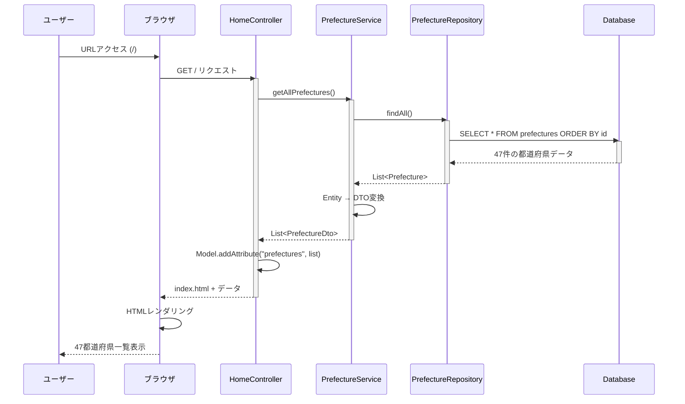
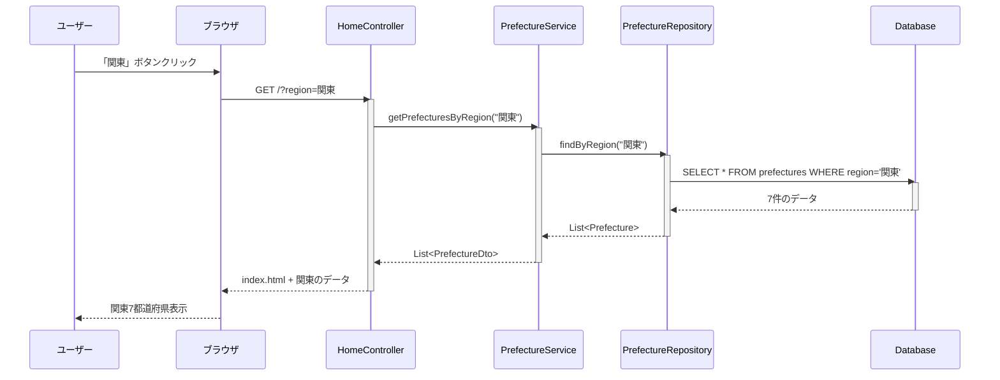
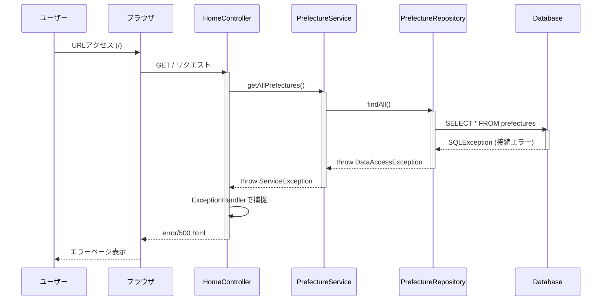

# Day 13: シーケンス図作成（一覧表示）

## 📅 実施日
- 予定: Week 3 - Day 13
- 実施日: YYYY/MM/DD
- 予定時間: 8h (午前4h + 午後4h)
- 実績時間: ____h

## 🎯 目標
トップページ（都道府県一覧）のシーケンス図を作成する

---

## 📋 午前の作業（9:00-13:00）

### 1. シーケンス図の基礎学習（9:00-10:00）

**シーケンス図とは:**
- システムの動作を時系列で表現する図
- オブジェクト間のメッセージのやり取りを可視化
- 実装前に処理の流れを確認するために作成

**登場人物（オブジェクト）:**
```
ユーザー → Browser → Controller → Service → Repository → Database
```

**シーケンス図の記法:**
```
Browser -> Controller: リクエスト送信
Controller -> Service: メソッド呼び出し
Service -> Repository: データ取得
Repository -> Database: SELECT文実行
Database --> Repository: 結果返却
Repository --> Service: Entityリスト返却
Service --> Controller: DTOリスト返却
Controller --> Browser: HTML返却
```

---

### 2. トップページのシーケンス図作成（10:00-12:00）

**シナリオ: トップページアクセス**

```
参加者:
- ユーザー
- ブラウザ
- HomeController
- PrefectureService
- PrefectureRepository
- Database
```

**処理フロー:**



**draw.ioで作成:**

1. draw.io を開く
2. UML → Sequence Diagram を選択
3. 上記の図を作成
4. ファイル名: `sequence-diagram-top-page.drawio`
5. PNGエクスポート: `sequence-diagram-top-page.png`

---

### 昼休憩（12:00-13:00）

---

## 📋 午後の作業（13:00-17:00）

### 3. 詳細なシーケンス図（地域フィルタ機能）（13:00-14:30）

**シナリオ: 地域別フィルタ（任意機能）**

```
ユーザーが「関東」ボタンをクリックした場合
```



---

### 4. エラーケースのシーケンス図（14:30-15:30）

**シナリオ: データベース接続エラー**



---

### 5. シーケンス図ドキュメントの作成（15:30-17:00）

`sequence-diagram-top-page.md`を作成：

```markdown
# トップページのシーケンス図

## 1. 基本フロー（全都道府県表示）

### 処理概要
1. ユーザーがトップページにアクセス
2. データベースから47都道府県を取得
3. 地域別にグループ化して表示

### 参加オブジェクト
- **ブラウザ**: ユーザーインターフェース
- **HomeController**: リクエスト処理
- **PrefectureService**: ビジネスロジック
- **PrefectureRepository**: データアクセス
- **Database**: データ永続化

### 詳細フロー

#### 1. リクエスト受付
```java
@GetMapping("/")
public String index(Model model) {
```

#### 2. Service呼び出し
```java
List<PrefectureDto> prefectures = prefectureService.getAllPrefectures();
```

#### 3. Repository呼び出し
```java
public List<PrefectureDto> getAllPrefectures() {
    List<Prefecture> entities = prefectureRepository.findAll();
    return entities.stream()
        .map(this::toDto)
        .collect(Collectors.toList());
}
```

#### 4. データベースクエリ
```sql
SELECT * FROM prefectures ORDER BY id
```

#### 5. DTO変換
```java
private PrefectureDto toDto(Prefecture entity) {
    return PrefectureDto.builder()
        .id(entity.getId())
        .name(entity.getName())
        .latitude(entity.getLatitude())
        .longitude(entity.getLongitude())
        .region(entity.getRegion())
        .build();
}
```

#### 6. Modelに追加
```java
model.addAttribute("prefectures", prefectures);
return "index";
```

#### 7. Thymeleafレンダリング
```html
<div th:each="pref : ${prefectures}">
    <a th:href="@{/weather/{id}(id=${pref.id})}" 
       th:text="${pref.name}"></a>
</div>
```

---

## 2. 地域フィルタフロー（オプション）

### 処理概要
特定の地域の都道府県のみを表示

### URLパラメータ
```
/?region=関東
```

### Controllerでの処理
```java
@GetMapping("/")
public String index(
    @RequestParam(required = false) String region,
    Model model
) {
    List<PrefectureDto> prefectures;
    
    if (region != null && !region.isEmpty()) {
        prefectures = prefectureService.getPrefecturesByRegion(region);
    } else {
        prefectures = prefectureService.getAllPrefectures();
    }
    
    model.addAttribute("prefectures", prefectures);
    model.addAttribute("selectedRegion", region);
    return "index";
}
```

### Repositoryメソッド
```java
List<Prefecture> findByRegion(String region);
```

### 生成されるSQL
```sql
SELECT * FROM prefectures WHERE region = '関東' ORDER BY id
```

---

## 3. エラーハンドリングフロー

### エラーケース
1. データベース接続エラー
2. データが0件
3. 予期しない例外

### 例外処理
```java
@ControllerAdvice
public class GlobalExceptionHandler {
    
    @ExceptionHandler(DataAccessException.class)
    public String handleDataAccessException(
        DataAccessException e, 
        Model model
    ) {
        log.error("Database error", e);
        model.addAttribute("errorMessage", "データベースエラーが発生しました");
        return "error/500";
    }
}
```

---

## パフォーマンス考察

### データ量
- 47都道府県（固定）
- 1リクエストあたり47件のデータ取得

### レスポンスタイム目標
- データベースクエリ: 10ms以内
- DTO変換: 5ms以内
- HTMLレンダリング: 50ms以内
- **合計: 100ms以内**

### 最適化ポイント
1. **キャッシング**: 都道府県マスタは変更されないため、キャッシュ可能
2. **インデックス**: prefectures.region にインデックス追加
3. **N+1問題**: 現状は発生しない（リレーションなし）
```

**成果物:**
- `sequence-diagram-top-page.drawio`
- `sequence-diagram-top-page.png`
- `sequence-diagram-top-page.md`

---

## ✅ チェックリスト

- [ ] シーケンス図の基礎を理解した
- [ ] トップページの基本フローを図示した
- [ ] 地域フィルタのフローを図示した
- [ ] エラーケースを図示した
- [ ] ドキュメントを作成した
- [ ] GitHubにコミット・プッシュした

---

## 📚 参考リンク

- [UML シーケンス図の書き方](https://www.uml-diagrams.org/sequence-diagrams.html)
- [Mermaid Sequence Diagram](https://mermaid.js.org/syntax/sequenceDiagram.html)
- [draw.io 使い方](https://drawio-app.com/)

---

## 📝 本日のまとめ

`day-13-summary.md`を作成し、以下を記録：

1. シーケンス図で理解が深まった点
2. 実装時に注意すべきポイント
3. 次のシーケンス図（詳細ページ）で追加したい要素

---

## 🎉 完了後

次は [Day 14](day-14.md) へ進む

お疲れさまでした！
