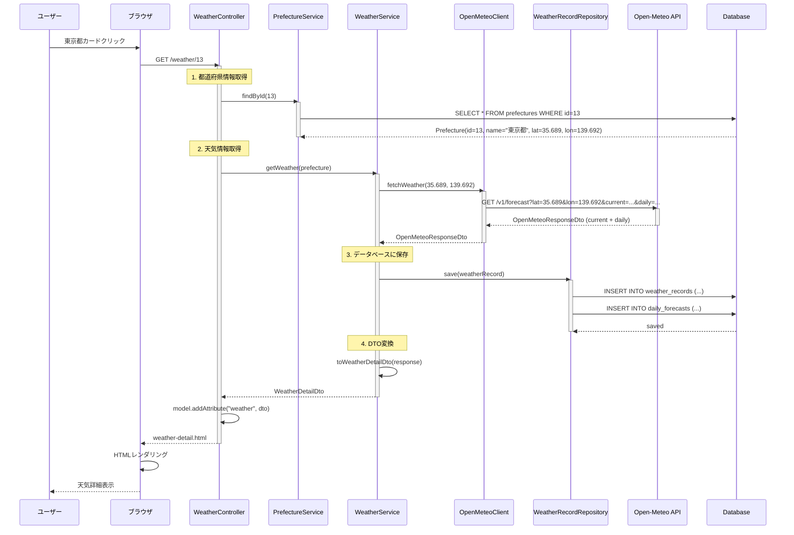
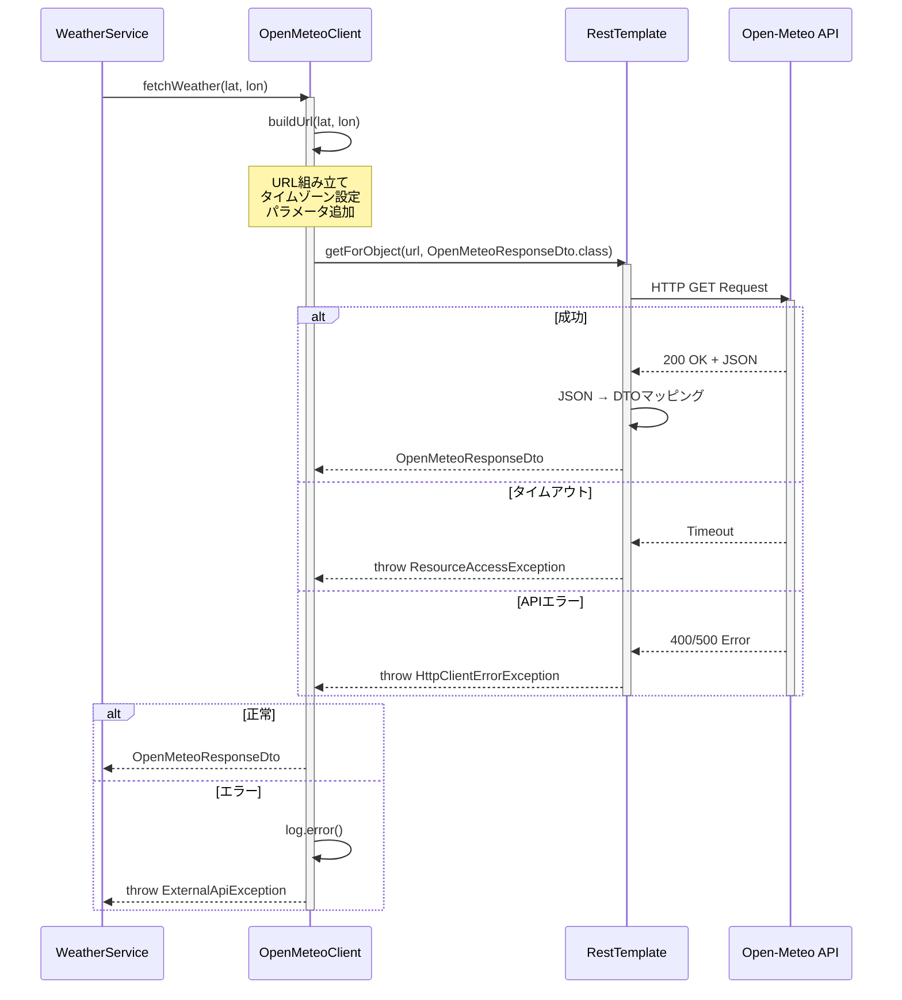
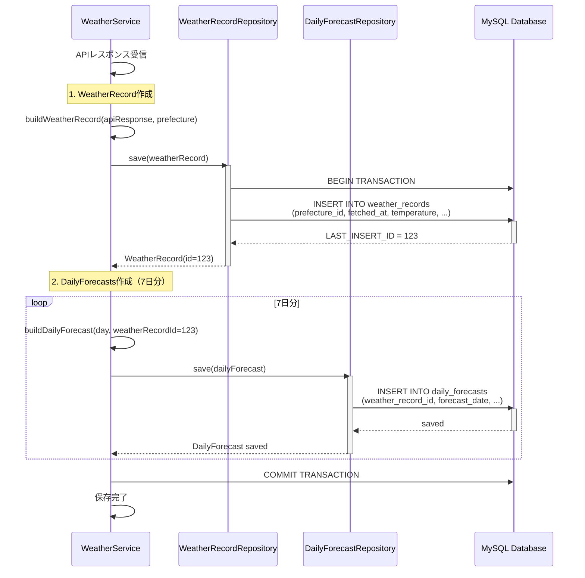
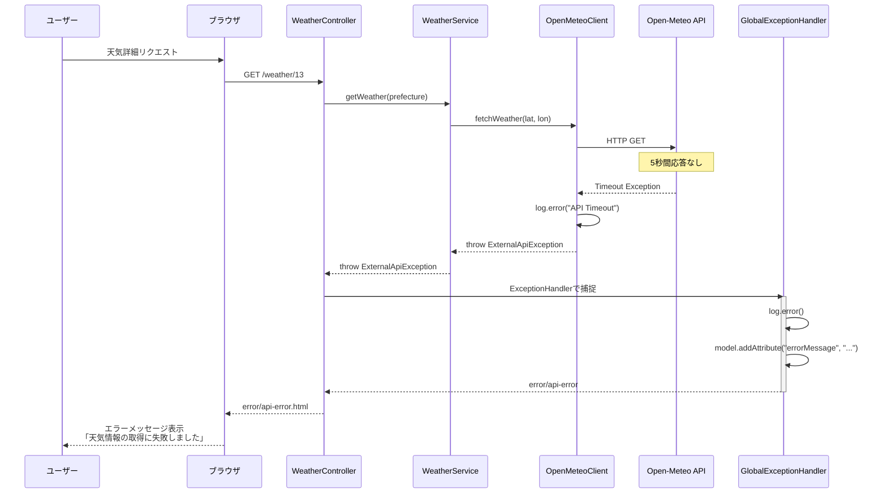
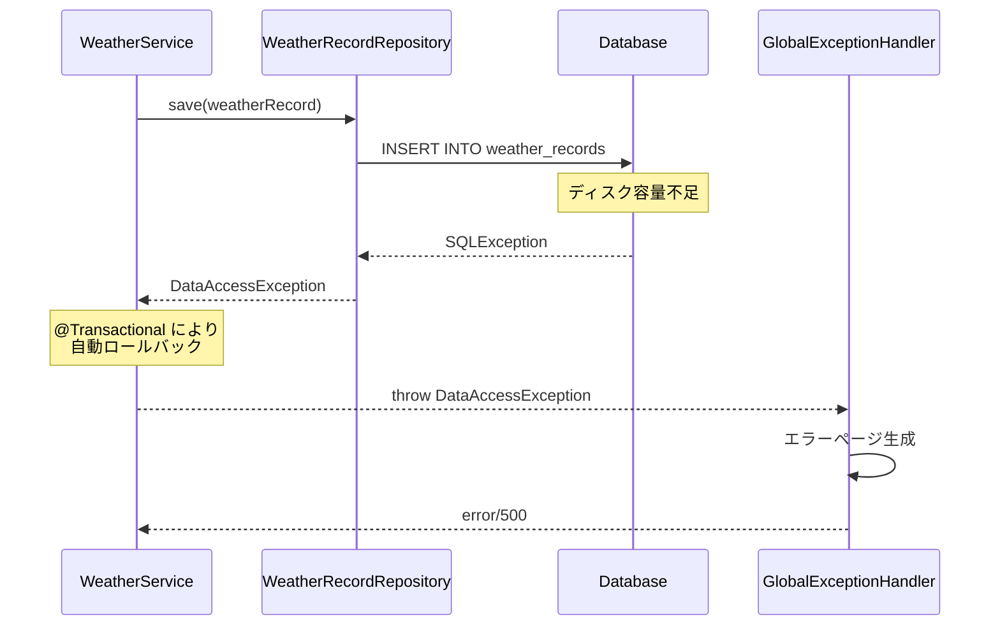

# Day 14: シーケンス図作成（詳細表示と履歴保存）

## 📅 実施日
- 予定: Week 3 - Day 14
- 実施日: YYYY/MM/DD
- 予定時間: 8h (午前4h + 午後4h)
- 実績時間: ____h

## 🎯 目標
天気詳細ページのシーケンス図を作成し、API連携と履歴保存の流れを明確にする

---

## 📋 午前の作業（9:00-13:00）

### 1. 天気詳細ページの基本フロー（9:00-11:00）

**シナリオ: 東京都の天気を表示**



**draw.ioで作成:**
- ファイル名: `sequence-diagram-weather-detail.drawio`

---

### 2. API呼び出しの詳細フロー（11:00-12:00）

**OpenMeteoClient の詳細:**



---

### 昼休憩（12:00-13:00）

---

## 📋 午後の作業（13:00-17:00）

### 3. データベース保存の詳細フロー（13:00-14:30）

**履歴保存のシーケンス:**



**トランザクション管理:**

```java
@Service
@Transactional
public class WeatherService {
    
    public WeatherDetailDto getWeather(Prefecture prefecture) {
        // 1. API呼び出し
        OpenMeteoResponseDto apiResponse = 
            openMeteoClient.fetchWeather(
                prefecture.getLatitude(), 
                prefecture.getLongitude()
            );
        
        // 2. WeatherRecord作成・保存
        WeatherRecord record = buildWeatherRecord(apiResponse, prefecture);
        WeatherRecord savedRecord = weatherRecordRepository.save(record);
        
        // 3. DailyForecasts作成・保存（7日分）
        List<DailyForecast> forecasts = buildDailyForecasts(
            apiResponse.getDaily(), 
            savedRecord
        );
        dailyForecastRepository.saveAll(forecasts);
        
        // 4. DTO変換
        return toDto(savedRecord, forecasts);
        
        // @Transactionalにより、すべて成功でCOMMIT、途中エラーでROLLBACK
    }
}
```

---

### 4. エラーハンドリングのシーケンス図（14:30-15:30）

**シナリオ1: API タイムアウト**



**シナリオ2: データベース保存失敗**



---

### 5. シーケンス図ドキュメントの完成（15:30-17:00）

`sequence-diagram-weather-detail.md`を作成：

```markdown
# 天気詳細ページのシーケンス図

## 処理フロー全体像

### 主要な処理
1. **都道府県情報取得**: prefectures テーブルから緯度・経度を取得
2. **API呼び出し**: Open-Meteo APIで天気情報を取得
3. **履歴保存**: weather_records と daily_forecasts に保存
4. **DTO変換**: 表示用データに変換
5. **HTMLレンダリング**: Thymeleafで画面表示

---

## 1. 基本フロー

### URL
```
GET /weather/{prefectureId}
```

### Controllerメソッド
```java
@GetMapping("/weather/{prefectureId}")
public String getWeatherDetail(
    @PathVariable Long prefectureId,
    Model model
) {
    // 1. 都道府県取得
    Prefecture prefecture = prefectureService.findById(prefectureId);
    
    // 2. 天気情報取得（API + DB保存）
    WeatherDetailDto weather = weatherService.getWeather(prefecture);
    
    // 3. Modelに追加
    model.addAttribute("prefecture", prefecture);
    model.addAttribute("weather", weather);
    
    return "weather-detail";
}
```

---

## 2. API呼び出し

### OpenMeteoClient
```java
@Component
@Slf4j
public class OpenMeteoClient {
    
    private final RestTemplate restTemplate;
    
    public OpenMeteoResponseDto fetchWeather(Double lat, Double lon) {
        String url = buildUrl(lat, lon);
        
        log.info("Calling Open-Meteo API: lat={}, lon={}", lat, lon);
        
        try {
            return restTemplate.getForObject(url, OpenMeteoResponseDto.class);
        } catch (ResourceAccessException e) {
            log.error("API Timeout: {}", e.getMessage());
            throw new ExternalApiException("API timeout", e);
        } catch (HttpClientErrorException | HttpServerErrorException e) {
            log.error("API Error: {}", e.getMessage());
            throw new ExternalApiException("API error", e);
        }
    }
    
    private String buildUrl(Double lat, Double lon) {
        return UriComponentsBuilder
            .fromUriString("https://api.open-meteo.com/v1/forecast")
            .queryParam("latitude", lat)
            .queryParam("longitude", lon)
            .queryParam("current", "temperature_2m,weathercode,windspeed_10m,relativehumidity_2m")
            .queryParam("daily", "temperature_2m_max,temperature_2m_min,weathercode,precipitation_sum")
            .queryParam("timezone", "Asia/Tokyo")
            .queryParam("forecast_days", 7)
            .toUriString();
    }
}
```

---

## 3. データベース保存

### WeatherRecord
```java
WeatherRecord record = WeatherRecord.builder()
    .prefecture(prefecture)
    .fetchedAt(LocalDateTime.now())
    .temperature(apiResponse.getCurrent().getTemperature2m())
    .weatherCode(apiResponse.getCurrent().getWeathercode())
    .windSpeed(apiResponse.getCurrent().getWindspeed10m())
    .humidity(apiResponse.getCurrent().getRelativehumidity2m())
    .build();

weatherRecordRepository.save(record);
```

### DailyForecasts（7日分）
```java
List<DailyForecast> forecasts = new ArrayList<>();

DailyWeatherDto daily = apiResponse.getDaily();
for (int i = 0; i < daily.getTime().size(); i++) {
    DailyForecast forecast = DailyForecast.builder()
        .weatherRecord(savedRecord)
        .forecastDate(LocalDate.parse(daily.getTime().get(i)))
        .temperatureMax(daily.getTemperature2mMax().get(i))
        .temperatureMin(daily.getTemperature2mMin().get(i))
        .weatherCode(daily.getWeathercode().get(i))
        .precipitationSum(daily.getPrecipitationSum().get(i))
        .build();
    
    forecasts.add(forecast);
}

dailyForecastRepository.saveAll(forecasts);
```

---

## 4. エラーハンドリング

### カスタム例外
```java
public class ExternalApiException extends RuntimeException {
    public ExternalApiException(String message, Throwable cause) {
        super(message, cause);
    }
}
```

### GlobalExceptionHandler
```java
@ControllerAdvice
public class GlobalExceptionHandler {
    
    @ExceptionHandler(ExternalApiException.class)
    public String handleApiException(
        ExternalApiException e,
        Model model
    ) {
        log.error("External API Error", e);
        model.addAttribute("errorMessage", "天気情報の取得に失敗しました");
        return "error/api-error";
    }
    
    @ExceptionHandler(DataAccessException.class)
    public String handleDatabaseException(
        DataAccessException e,
        Model model
    ) {
        log.error("Database Error", e);
        model.addAttribute("errorMessage", "データベースエラーが発生しました");
        return "error/500";
    }
}
```

---

## パフォーマンス考察

### レスポンスタイム目標
- API呼び出し: 200-500ms
- データベース保存: 50ms
- DTO変換: 10ms
- HTMLレンダリング: 100ms
- **合計目標: 1秒以内**

### ボトルネック
1. **Open-Meteo API**: 外部依存のため制御不可
2. **データベース保存**: トランザクション処理

### 改善案
1. **ローディング表示**: JavaScriptでユーザー体験向上
2. **キャッシング**: 同じ都道府県は1時間以内は再取得しない
3. **非同期処理**: API呼び出しを非同期化（今回は見送り）
```

**成果物:**
- `sequence-diagram-weather-detail.drawio`
- `sequence-diagram-weather-detail.png`
- `sequence-diagram-weather-detail.md`

---

## ✅ チェックリスト

- [ ] 天気詳細ページの基本フローを図示した
- [ ] API呼び出しの詳細を図示した
- [ ] データベース保存の詳細を図示した
- [ ] エラーハンドリングを図示した
- [ ] ドキュメントを作成した
- [ ] GitHubにコミット・プッシュした

---

## 📚 参考リンク

- [Spring @Transactional](https://docs.spring.io/spring-framework/reference/data-access/transaction/declarative.html)
- [RestTemplate](https://docs.spring.io/spring-framework/reference/integration/rest-clients.html)

---

## 📝 本日のまとめ

`day-14-summary.md`を作成

---

## 🎉 完了後

次は [Day 15](day-15.md) へ進む

お疲れさまでした！
